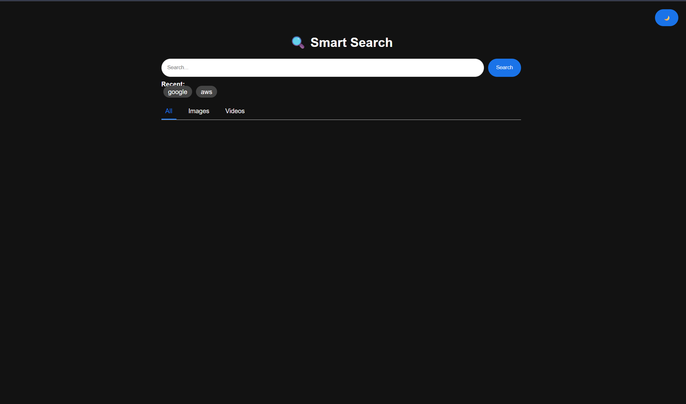
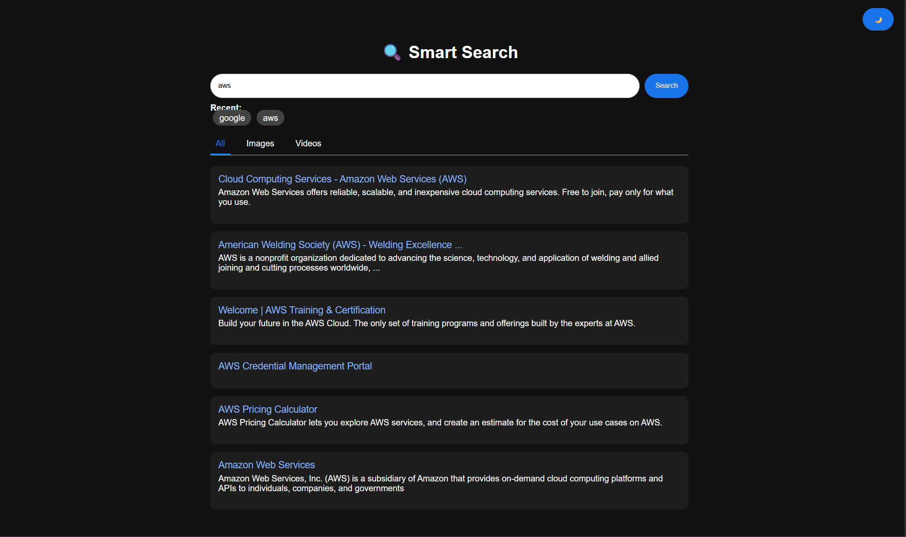

# 🔍 Smart Search

A modern search engine web app built using Flask + SerpAPI.  
It supports web search, image search, and video search with a clean Google-like UI.

---

## 🚀 Features

- 🔍 Web Search (Google results)
- 🖼️ Image Search (grid layout)
- 🎥 Video Search (YouTube-style cards)
- 🌙 Dark / Light Mode toggle
- ⚡ Live search suggestions
- 🧠 Search history (localStorage)
- 🎯 Tabs (All | Images | Videos)
- ⏳ Loading spinner

---

## 🛠️ Tech Stack

- Backend: Flask
- Frontend: HTML, CSS, JavaScript
- API: SerpAPI (Google Search API)
- Deployment: Render

---

## 📁 Project Structure
```
│
├── app.py
├── requirements.txt
├── runtime.txt
├── templates/
│ └── index.html
├── .env (not uploaded)
└── README.md
```
----
## 🔒 Environment Variables

Create a `.env` file:
----

## ▶️ Run Locally

### 1. Clone Repo
### 2. Install Dependencies
### 3. Run App
### 3. Run App

---

## 📸 Screenshots

- Search UI
- Image Results Grid
- Video Cards UI
- Dark Mode

<p align="center">
  <h4>Home</h4>
  
  <h4>Search</h4>
  
</p>
---

## ⚠️ Notes

- Free SerpAPI plan has limited searches
- Render free plan may sleep after inactivity

---

## 🚀 Future Improvements

- 🎬 Play videos inside the app
- 📺 Show channel & duration
- 🔎 Pagination like Google
- ⚡ Caching for faster results
- 🌐 Custom domain support

---

## 🤝 Contributing

Pull requests are welcome!  
For major changes, please open an issue first.

---

## 📄 License

This project is open-source and free to use.

---

## 👨‍💻 Author

**Pratik Pawar**
